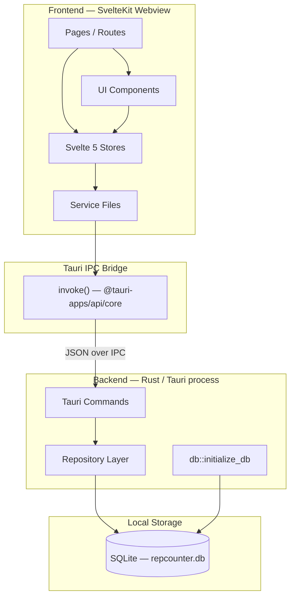
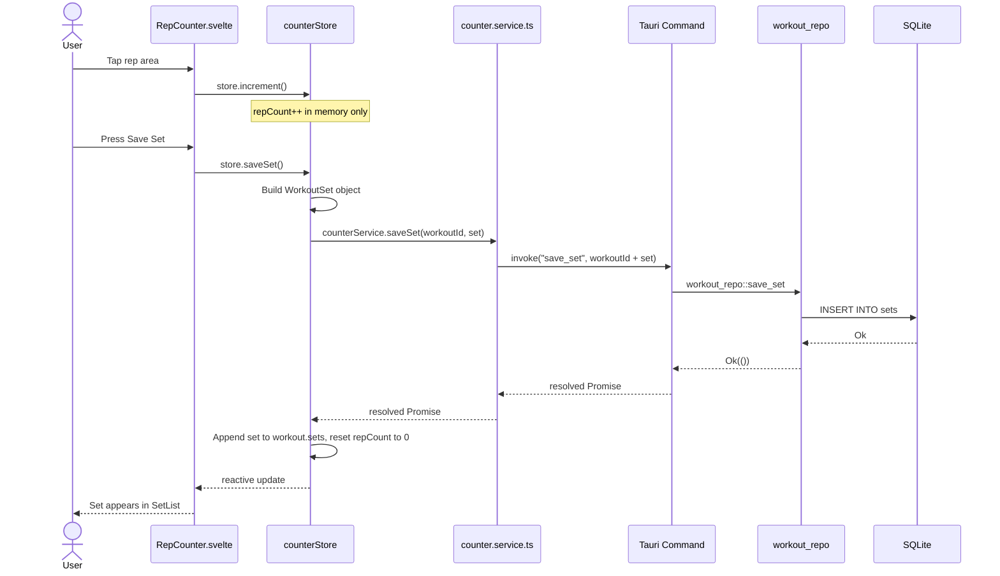
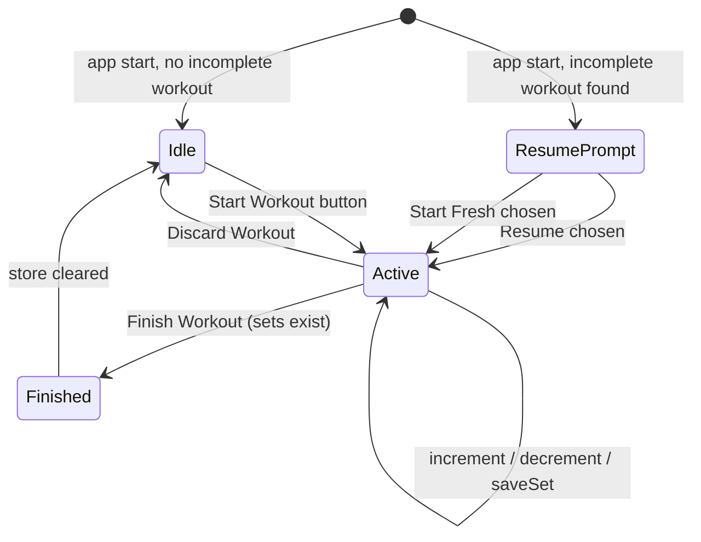
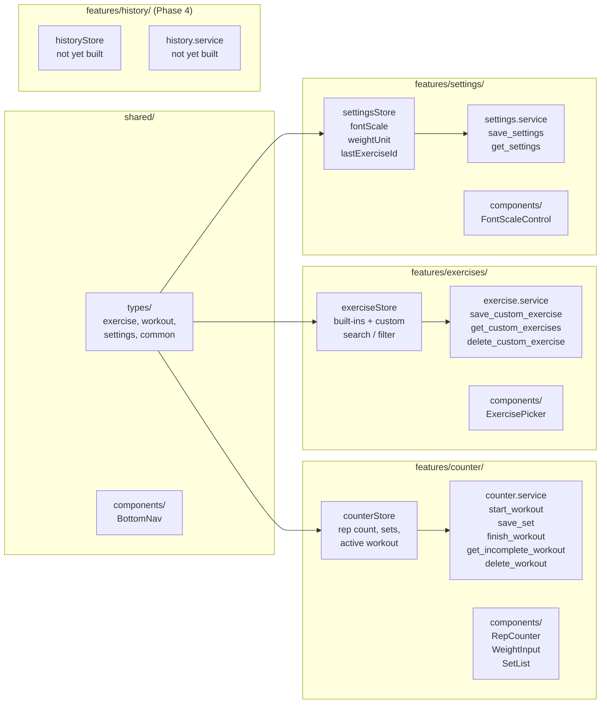
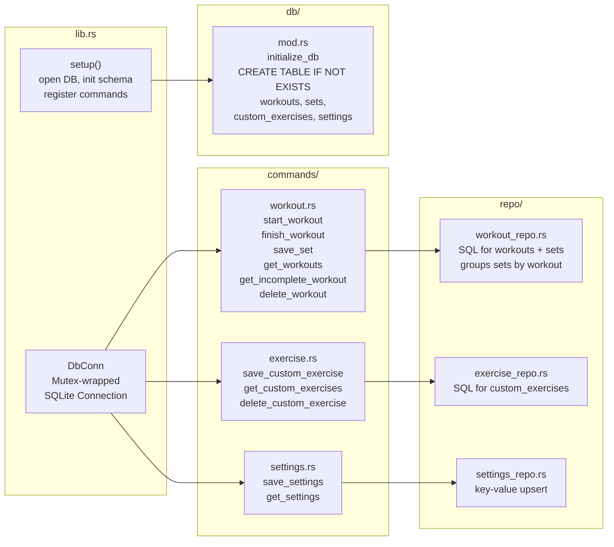
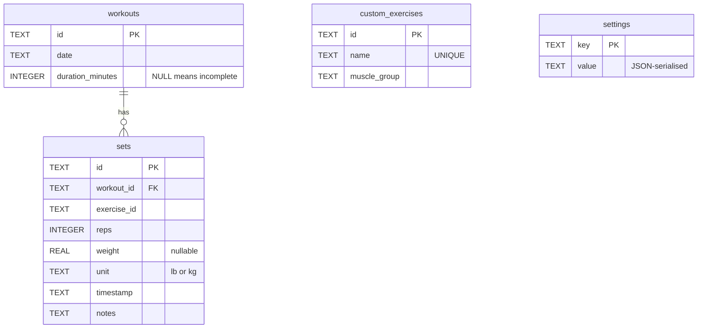

# SetForge — Architecture Overview

A Tauri v2 desktop app. The frontend is SvelteKit (TypeScript/Svelte 5) running in a Webview; the backend is Rust, accessed exclusively through named Tauri commands over an IPC bridge. All data lives in a local SQLite file — there is no network layer.

---

## High-Level Layers



---

## Data Capture & Persistence Flow

The critical path from a user tap to a persisted row.



---

## Workout Lifecycle State Machine



---

## Frontend Module Structure



---

## Backend Module Structure



---

## SQLite Schema



---

## CI/CD Pipeline

Two GitHub Actions workflows govern quality and releases. Both live in `.github/workflows/`.

### Workflow: `ci.yml` — Continuous Integration

Triggers on **every push to any branch** (not tags). Runs unit tests only.

```
push to branch
    └── test (ubuntu-latest)
            ├── apt-get install libwebkit2gtk-4.1-dev ...  ← Tauri native deps
            ├── npm ci
            ├── npx vitest run                             ← frontend tests
            └── cd src-tauri && cargo test --lib           ← Rust lib tests
```

Purpose: catch regressions fast on every commit. ubuntu-latest is the fastest and cheapest runner for pure test work.

### Workflow: `release.yml` — Release Pipeline

Triggers on **`v*` tag pushes only**. The `test` job acts as a gate: build jobs only start if tests pass.

```
push v* tag
    └── test (ubuntu-latest)          ← same suite as ci.yml
            ├── build-windows (windows-latest)
            │       └── npx tauri build → .msi + .exe
            └── build-android (ubuntu-latest)
                    └── npx tauri android build --apk
                            └── release
                                    └── Create GitHub Release (attaches all artifacts)
```

### Pipeline Rules

| Rule | Reason |
|---|---|
| Tags skip `ci.yml` (`branches: ['**']` filter) | Prevents double test run when a tag is pushed |
| `release.yml` always re-runs its own `test` job | A direct tag push (bypassing a branch push) still can't skip tests |
| Tests run on `ubuntu-latest` in both workflows | ubuntu is faster and cheaper than `windows-latest` for pure Vitest + cargo test work |
| Build jobs use `needs: [test]` | Failed tests abort the pipeline before any expensive Tauri compilation begins |
| Linux CI installs GTK/WebKit system libs before Rust tests | `cargo test --lib` on ubuntu still compiles Tauri crate dependencies that link against `glib-2.0`, `libssl`, `librsvg2`, and `libayatana-appindicator3` |
| CI uses `cargo test --lib` not `cargo test` | `cargo test` without `--lib` also compiles the binary target, which requires a display server — `--lib` tests the library crate only, covering all repo/model/command logic |

---

## Key Architectural Constraints

| Rule | Where enforced |
|---|---|
| Only service files call `invoke()` — never components or stores directly | ESLint `no-restricted-imports` rule |
| Features never import from other features — shared code goes in `shared/` | ESLint `no-restricted-imports` rule |
| All sizing in `rem`, never `px` (except borders) | Code review / CLAUDE.md |
| Components receive data via props — they never import stores | AGENTS.md convention |
| Rust commands are thin (max 10 lines) — logic goes in `repo/` | AGENTS.md convention |
| No `.unwrap()` in Rust production code, no `any` in TypeScript | CLAUDE.md |
